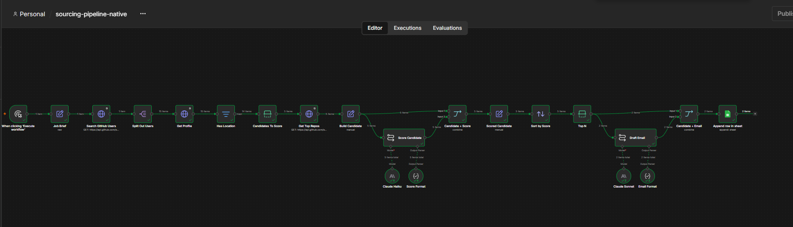
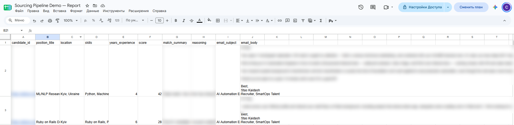

# Sourcing Pipeline (n8n)

Recruiting-ops automation built entirely from native n8n nodes: find developers on GitHub → score them against a job brief with Claude → draft personalized outreach emails for the best matches → write everything to Google Sheets for a recruiter to review.

No code nodes, no scripts. A recruiter can change the role, the search and the sender in one node and run it.

## What it does

1. **Search.** Queries the GitHub Search API for developers matching a location + language + activity filter.
2. **Enrich.** Fetches each developer's full profile and their top-5 own repositories by stars (forks excluded).
3. **Score.** Claude Haiku 4.5 rates every candidate 0-100 against the job brief with a fixed rubric and explains the score. It also infers what GitHub doesn't state directly: skills, years of experience, English level, a fitting job title.
4. **Shortlist.** Sorts by score and keeps the top N.
5. **Draft.** Claude Sonnet 5 writes a short personalized email for each shortlisted candidate, referencing a concrete repo or skill from their profile, signed by the recruiter.
6. **Report.** Appends one row per candidate to Google Sheets. Emails are drafts: nothing is sent automatically.

## Workflow, node by node

| # | Node | Type | Purpose |
|---|---|---|---|
| 1 | When clicking 'Execute workflow' | Manual Trigger | Run on demand (swap for Schedule or an ATS webhook in production) |
| 2 | **Job Brief** | Edit Fields (JSON) | Single place for every setting: role, must-have / nice-to-have skills, GitHub search query, how many candidates to score, top N, sender name |
| 3 | Search GitHub Users | HTTP Request | `GET /search/users` with the query from Job Brief |
| 4 | Split Out Users | Split Out | One item per user, so every next node runs once per candidate |
| 5 | Get Profile | HTTP Request | `GET /users/{login}` for bio, location, company, account age |
| 6 | Has Location | Filter | Keeps real users (`type = User`) with a location set |
| 7 | Candidates To Score | Limit | Caps how many profiles go to the paid steps |
| 8 | Get Top Repos | HTTP Request | `GET /search/repositories?q=user:{login} fork:false&sort=stars`, one object per candidate |
| 9 | Build Candidate | Edit Fields | Joins the profile (via paired item) with a one-line-per-repo summary |
| 10 | **Score Candidate** | Basic LLM Chain + Claude Haiku + Structured Output Parser | Rubric scoring, `temperature 0`, schema-checked JSON |
| 11 | Candidate + Score | Merge (by position) | Puts each candidate back together with their score |
| 12 | Scored Candidate | Edit Fields | Flattens the score fields to the top level |
| 13 | Sort by Score | Sort | Best first |
| 14 | Top N | Limit | Shortlist size from Job Brief |
| 15 | **Draft Email** | Basic LLM Chain + Claude Sonnet + Structured Output Parser | Subject + body, signed by the sender from Job Brief |
| 16 | Candidate + Email | Merge (by position) | Candidate + score + email in one item |
| 17 | Append row in sheet | Google Sheets | One row per shortlisted candidate |

## Design decisions

- **Native nodes over code.** The goal is automation a non-developer can maintain. Every step is visible on the canvas; LLM calls go through Basic LLM Chain instead of hand-built HTTP requests, and the Structured Output Parser enforces the JSON shape instead of manual parsing.
- **Model cascade.** Cheap, fast Haiku scores every candidate; Sonnet writes emails only for the shortlist. Most of the token spend goes where quality matters.
- **Reproducible scoring.** `temperature 0` and an explicit rubric (must-have skills 60, nice-to-have 25, location + English 15) so re-runs rank candidates the same way.
- **The model infers, and says how.** Skills, experience and English level are inferred by Claude from repos and bio, and the reasoning is written to the sheet. Account age is treated as a weak signal. Today's date is passed via `$now`, otherwise the model counts years from its own training cutoff.
- **One config node.** Everything a recruiter would change lives in Job Brief; the rest of the flow reads it with `$('Job Brief').first().json.*`.
- **Polite to the API.** Batching with a pause between GitHub requests and Retry On Fail on every HTTP node. Search via `/search/repositories` returns one object per user, so candidates don't get split into dozens of repo items.
- **Human in the loop.** The output is a review sheet with drafts, not sent emails. Tone, deliverability and final judgment stay with the recruiter.

## Setup

1. Import `n8n/workflow.json` into n8n (cloud or self-hosted).
2. Select credentials:
   - **Anthropic** on `Claude Haiku` and `Claude Sonnet`
   - **Google Sheets** on `Append row in sheet`, then pick your spreadsheet and sheet
3. Create the sheet header row: `candidate_id, position_title, location, skills, years_experience, score, match_summary, reasoning, email_subject, email_body`.
4. Edit **Job Brief**: role, skills, `search_query`, `candidates_to_score`, `top_n`, `sender_name`, `sender_title`.
5. Execute the workflow (about 40 seconds with the default pauses).

GitHub calls work without a token (60 requests/hour, enough for a run). For regular use, add a GitHub credential to the three HTTP Request nodes to raise the limit to 5,000/hour.

## Data and privacy

The workflow reads public GitHub profiles at runtime. Candidate data is stored only in the private Google Sheet the recruiter owns; nothing is committed to this repo. Screenshots have names, logins and profile links blurred.

## Next steps

- Minimum score threshold before drafting emails, so weak shortlists produce fewer drafts.
- Error workflow with a Telegram/Slack alert on failures.
- Gmail "Create draft" node to put emails straight into the recruiter's drafts.
- Deduplication against candidates already contacted.

## License

MIT
